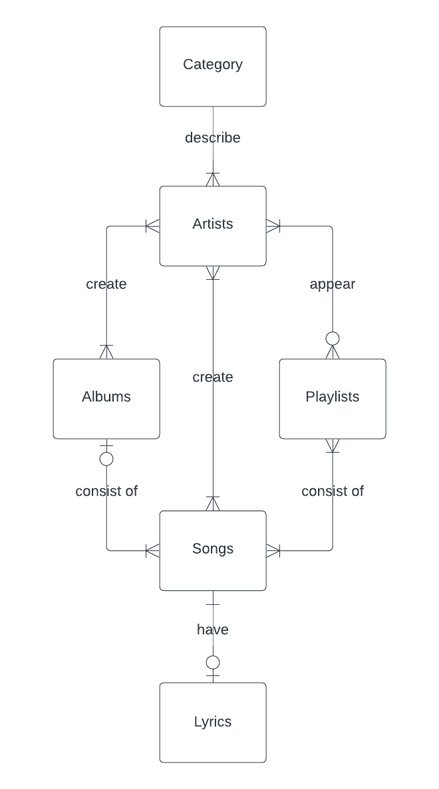

# Design Document

By Eduard Tretiacov

Video overview:< https://youtu.be/3zhRAdQGP74 >

## Scope

The database include all information about category, artists, albums, playlists , songs and lyrics.

## Functional Requirements
The database will support:
 * Crud operations for artists
 * Tracking all songs of artists
 * Tracking in which playlists artists appear

## Representation

The information can be stored in sqlite tables with the following schema
### Entities

The `categories` table include:

* `id`, which specifies the unique id of the category as in `INTEGER`. This column has the `PRIMARY KEY` constraint applied.
* `category` which specifies the cateogry AS `TEXT`

The `artists` table include:
* `id`, which specifies the unique id of the artist as `INTEGER`. This column has the `PRIMARY KEY` constraint applied.
* `first_name` which specifies the first name of aritst as `TEXT`
* `last_name` which specifies the last name of artist as `TEXT`
* `stage_name` which specifies the stage name of artist as `TEXT`
* `date_of_birth` which specifes the date when the artist was born as `NUMERIC`
* `date_of_death` which specifies the date when the artist died as `NUMERIC`
* `record_label` which specifies the label of artist as `TEXT`
* `category_id` which specifies the category as `INTEGER`. This column has the `FOREIGN KEY` constraint applied, referencing the `id` column in the `category` table
* `album_id` which specifies the category as `INTEGER`. This column has the `FOREIGN KEY` constraint applied, referencing the `id` column in the `albums` table
* `playlist_id` which specifies the category as `INTEGER`. This column has the `FOREIGN KEY` constraint applied, referencing the `id` column in the `playlists` table
* `song_id` which specifies the category as `INTEGER`. This column has the `FOREIGN KEY` constraint applied, referencing the `id` column in the `songs` table

The `albums` table include:
* `id` which specifies the UNIQUE ID of the table as `INTEGER`. This column has the `PRIMARY KEY` constraint applied.
* `name` which specifies the name of the album as `TEXT`
* `release_date` which specifies the date when the album was released as `NUMERIC`
* `total_duration` which specifies the duration of the album as `NUMERIC`
* `artist_id` which specifies the category as `INTEGER`. This column has the `FOREIGN KEY` constraint applied, referencing the `id` column in the `artists` table
* `song_id` which specifies the category as `INTEGER`. This column has the `FOREIGN KEY` constraint applied, referencing the `id` column in the `songs` table

The `playlists` table include:
* `id` which specifies the UNIQUE ID of the playlist as `INTEGER`. This column has the `PRIMARY KEY` constraint applied.
* `name` which specifies the name of the playlist as `TEXT`
* `description` which specifies the description of album as `TEXT`
* `duration` which specifies the duration of the playlist as `NUMERIC`
* `artist_id` which specifies the category as `INTEGER`. This column has the `FOREIGN KEY` constraint applied, referencing the `id` column in the `artists` table
* `song_id` which specifies the category as `INTEGER`. This column has the `FOREIGN KEY` constraint applied, referencing the `id` column in the `songs` table

The `songs` table include:
* `id` which specifies the UNIQUE ID of the playlist as `INTEGER`. This column has the `PRIMARY KEY` constraint applied.
 `name` which specifies the name of the playlist as `TEXT`
* `description` which specifies the description of album as `TEXT`
* `artist_id` which specifies the category as `INTEGER`. This column has the `FOREIGN KEY` constraint applied, referencing the `id` column in the `artists` table
* `album_id` which specifies the category as `INTEGER`. This column has the `FOREIGN KEY` constraint applied, referencing the `id` column in the `albums` table
* `playlist_id` which specifies the category as `INTEGER`. This column has the `FOREIGN KEY` constraint applied, referencing the `id` column in the `playlists` table
* `lyrics_id` which specifies the category as `INTEGER`. This column has the `FOREIGN KEY` constraint applied, referencing the `id` column in the `lyrics` table

The `lyrics` table include:
* `id` which specifies the UNIQUE ID of the playlist as `INTEGER`. This column has the `PRIMARY KEY` constraint applied.
* `text` which specify the lyrics the song as `TEXT`

### Relationships

* One category can describe in what genre the artist work, an artist can have one or many categories
* An artist can create one or many albums , the album can be created by one or many artists.
An artist can appear in no playlist or many playlists , the playlists can be consists of one or many artists.
An artist can create on song or many songs , the song can be created by one or many artists.
* The songs can be in no album or one album, the album can consist of one or many songs.
The songs can be in one or many playlists, the playlist can consist of one or many songs.
* The songs can have lyrics or not.

## Optimizations
The indexes are created on `stage_name` of `artists` table and on `name` column of `albums` table

## Limitations
The current database include only the information about the artists, songs , albums, playlists. The database does not provide the information about the label , future concerts.